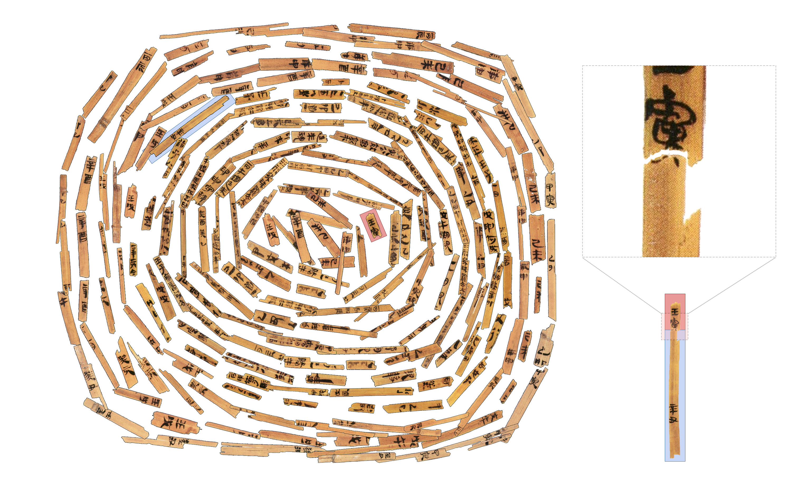
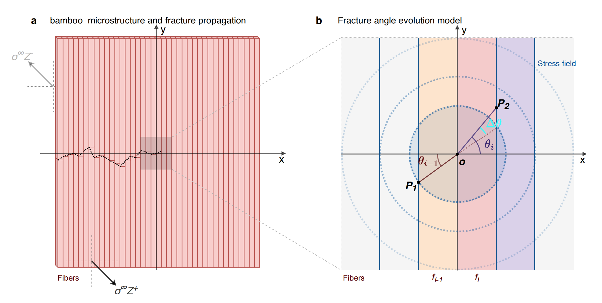
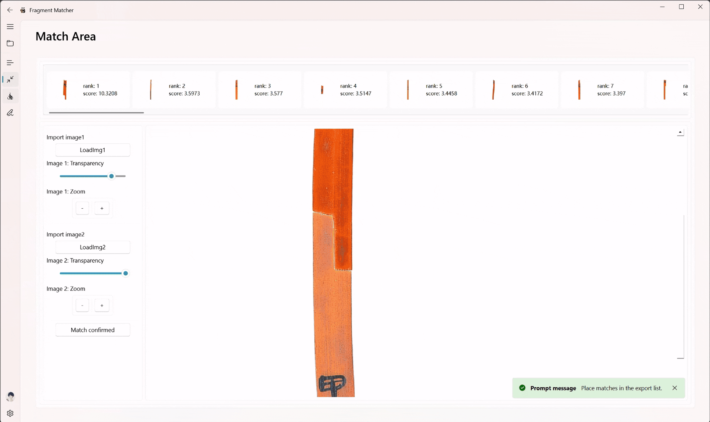

<p align="center" style="margin-bottom:1em;" >

</p>
# Rejoining fragmented ancient bamboo slips with physics-driven deep learning

Bamboo slips, serving as a fundamental medium for documenting ancient East Asian civilizations,contain invaluable historical records spanning philosophy, law, and social life-period. Their durability has enabled these artifacts to survive millennia underground while retaining legible content, offering scholars unprecedented insights into historical societies. However, the excavation of these delicate artifacts presents a critical challenge - many bamboo slips have been fragmented into thousands of pieces, significantly complicating efforts to reconstruct and interpret their content. This fragmentation creates a fundamental obstacle in accessing the wealth of historical knowledge contained in these artifacts.We present WisePanda, the first physics-driven deep learning framework designed for rejoining fragmented ancient bamboo slips.WisePanda is designed to assist and expand the archaeologist’s workflow: its architecture features an interpretable pipeline for fragmented bamboo slip rejoining, leveraging synthesized data based on fracture physics for model training and providing top-k predictions to support expert decision-making.

<p align="center" style="margin-top:2em; margin-bottom:2em;" >
<br />
<em>The challenge of bamboo slip rejoining in archaeological research: with thousands of Qin dynasty fragments arranged in spirals, each potentially matching any other.</em>
</p>

Compared to the leading curve matching method, WisePanda increases Top-20 matching accuracy from 35% to 69%. Archaeologists using WisePanda have experienced substantial efficiency improvements (20 times faster) when rejoining fragmented bamboo slips,demonstrating the powerful impact of this collaborative research tool.Based on the physics of fracture and material deterioration, WisePanda automatically generates synthetic training data that captures the physical properties of bamboo fragmentations. This approach enables the training of a matching network without requiring manually paired samples, providing ranked suggestions to facilitate the rejoining process.This work demonstrates how models like WisePanda can enhance collaboration between AI and historians, fundamentally transforming how we study and interpret the rich and complex history of China.

<p align="center" style="margin-top:2em; margin-bottom:2em;" >
<br />
<em>WisePanda's architecture processing the fragments of bamboo silks.The system processes inputs through several stages.During inference (red arrows), the target fragment (highlighted in pink) is compared against all candidates to generate a ranked list of potential matches (bottom),typically presenting the top 50 candidates to archaeologists for final verification.The highlighted candidate at position 5 represents an expert-verified correct match after examining the system’s suggested ranking list.</em>
</p>

While manual fragment rejoining is prohibitively time-consuming - the very problem we aim to solve - this same process would traditionally be required to generate training data for the model. We resolve this dilemma by resorting to the physics of fracture.By modeling the physical properties of bamboo and the processes that govern its degradation, we generate extensive synthetic training data that captures the essential characteristics of real paired fragment slips. This physics-driven approach enables us to produce large-scale, realistic training data without requiring manual matching efforts, while ensuring the model learns meaningful patterns based on actual material properties rather than superficial features.

<p align="center" style="margin-top:2em; margin-bottom:2em;" >
<br />
<em>Physics-driven modeling of bamboo slip fracture and deterioration.a, The breakage process of bamboo slips.b, Detailed stress field model illustrating the mathematical relationship between the fracture angles (θ<sub>i-1</sub>,θ<sub>i</sub> ) and the stress propagation in the x-y coordinate system.c, Time-sequential simulation of the corrosion process.d, Collection of real bamboo slip fracture curves extracted from archaeological samples.e, Synthetically generated fracture curves produced by our physics-driven model.</em>
</p>

<p align="center" style="margin-top:2em; margin-bottom:2em;" >
<br />
<em>Physics-driven model of bamboo fracture propagation.a, Bamboo microstructure and fracture propagation, showing vertical fiber bundles (red lines) and how a typical fracture path (dotted black line) traverses across multiple fibers in the x-y coordinate system.b, Fracture angle evolution model illustrating how stress propagates from one fiber to the next. Point o represents the fracture endpoint on the current fiber, while points m and n indicate the starting positions on the adjacent fibers. The angles θ<sub>i-1</sub> and θ<sub>i</sub> represent the fracture direction at consecutive fiber bundles (f<sub>i-1</sub> and f<sub>i</sub>), with the stress field (blue dotted circles) determining the probabilistic transition between angles</em>
</p>

## Key Features

- First physics-driven deep learning framework designed for rejoining fragmented ancient bamboo slips
- Achieves high accuracy compared with vision model
- Handles both fracture pattern generation and material degradation simulation
- Establishes a new paradigm for fragment matching where training data is scarce.
- Combines physical principles with artificial intelligence
- Intuitive GUI for selection, comparison, and verification integrated AI-assistant

## Quik Start Guide

### 1.Installation

```
# Create and activate conda environment
conda create -n fratcher python=3.11
conda activate fratcher

# Install requirements
pip install -r requirements.txt

# Install full version Qfluentwidgets
pip install "PyQt6-Fluent-Widgets[full]" -i https://pypi.org/simple/
```

### 2.Launch Fratcher

```
python demo.py
```


## Use Examples
<p align="center">
  <br>
  <br>
  
</p>


## Algorithm Code
- The core algorithm implementations and related code referenced by this project can be found within the algorithm/ directory. Please refer to the source files in that location for specific details on the algorithms used.