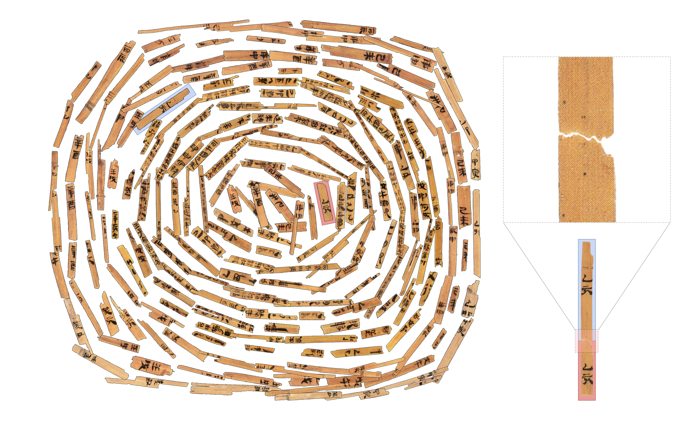
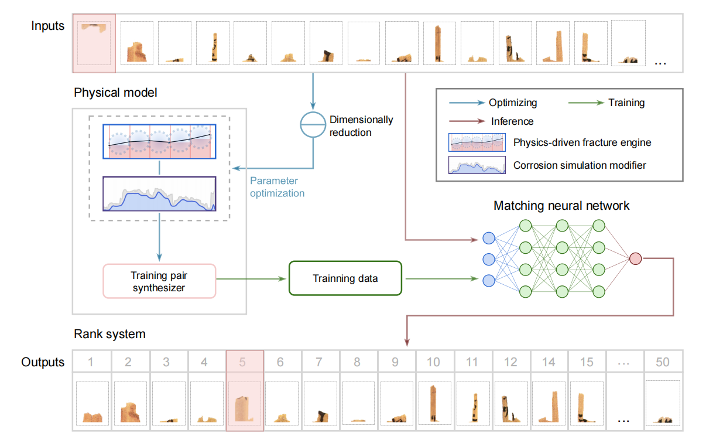
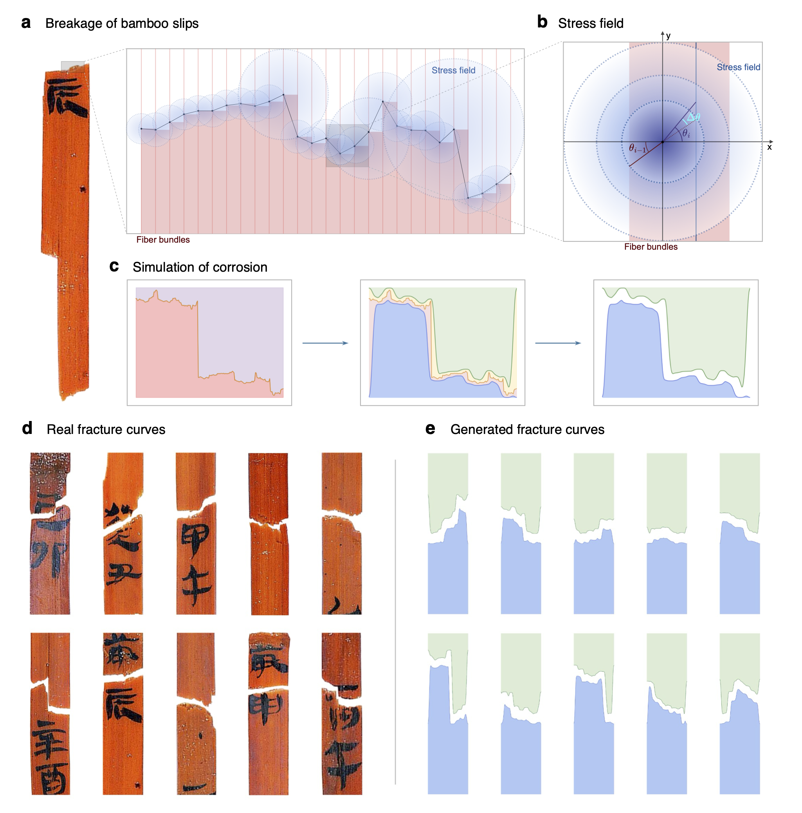
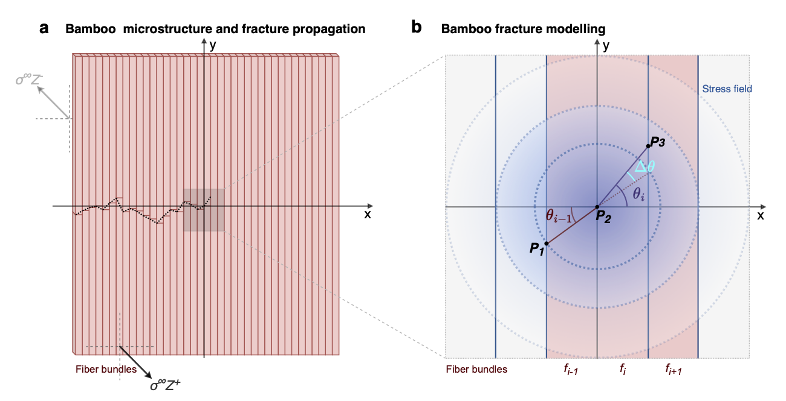
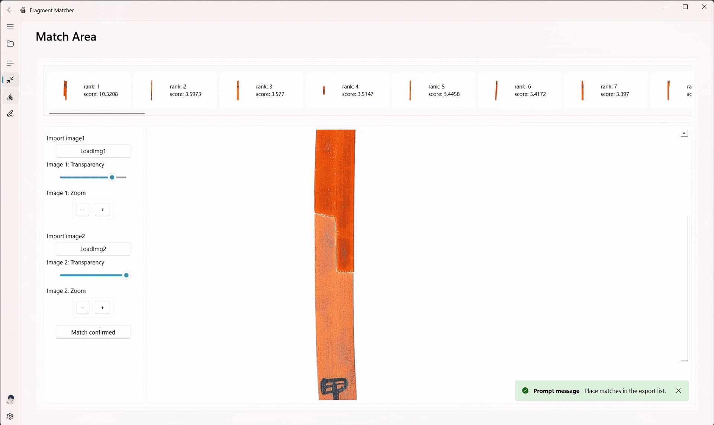

<p align="center" style="margin-bottom:1em;" >

</p>

# Rejoining fragmented ancient bamboo slips with physics-driven deep learning

Bamboo slips, serving as a fundamental medium for documenting ancient East Asian civilizations,contain invaluable historical records spanning philosophy, law, and social life-period. Their durability has enabled these artifacts to survive millennia underground while retaining legible content, offering scholars unprecedented insights into historical societies. However, the excavation of these delicate artifacts presents a critical challenge - many bamboo slips have been fragmented into thousands of pieces, significantly complicating efforts to reconstruct and interpret their content. This fragmentation creates a fundamental obstacle in accessing the wealth of historical knowledge contained in these artifacts. We present WisePanda, the first physics-driven deep learning framework designed for rejoining fragmented ancient bamboo slips. WisePanda is designed to assist and expand the archaeologist’s workflow: its architecture features an interpretable pipeline for fragmented bamboo slip rejoining, leveraging synthesized data based on fracture physics for model training and providing top-k predictions to support expert decision-making.

<p align="center" style="margin-top:2em; margin-bottom:2em;" >
<br />
<em>The challenge of bamboo slip rejoining in archaeological research: with thousands of Qin dynasty fragments arranged in spirals, each potentially matching any other.</em>
</p>

Compared to the leading curve matching method, WisePanda increases Top-50 matching accuracy from 36% to 52%. Archaeologists using WisePanda have experienced substantial efficiency improvements (20 times faster) when rejoining fragmented bamboo slips,demonstrating the powerful impact of this collaborative research tool. Based on the physics of fracture and material deterioration, WisePanda automatically generates synthetic training data that captures the physical properties of bamboo fragmentations. This approach enables the training of a matching network without requiring manually paired samples, providing ranked suggestions to facilitate the rejoining process. This work demonstrates how models like WisePanda can enhance collaboration between AI and historians, fundamentally transforming how we study and interpret the rich and complex history of China.

<p align="center" style="margin-top:2em; margin-bottom:2em;" >
<br />
<em>WisePanda's architecture processing the fragments of bamboo silks.The system processes inputs through several stages.During inference (red arrows), the target fragment (highlighted in pink) is compared against all candidates to generate a ranked list of potential matches (bottom),typically presenting the top 50 candidates to archaeologists for final verification. The highlighted candidate at position 5 represents an expert-verified correct match after examining the system’s suggested ranking list.</em>
</p>

While manual fragment rejoining is prohibitively time-consuming - the very problem we aim to solve - this same process would traditionally be required to generate training data for the model. We resolve this dilemma by resorting to the physics of fracture.By modeling the physical properties of bamboo and the processes that govern its degradation, we generate extensive synthetic training data that captures the essential characteristics of real paired fragment slips. This physics-driven approach enables us to produce large-scale, realistic training data without requiring manual matching efforts, while ensuring the model learns meaningful patterns based on actual material properties rather than superficial features.

<p align="center" style="margin-top:2em; margin-bottom:2em;" >
<br />
<em>The breakage process of bamboo slips showing how fracture propagates across the bamboo’s fiber structure, with the resulting irregular curve composed of black line segments and the corresponding stress field distribution (blue gradient).</em>
</p>

<p align="center" style="margin-top:2em; margin-bottom:2em;" >
<br />
<em>Bamboo microstructure showing vertical fiber bundles (red blocks) and a possible fracture path (composed of dotted black segments) traversing across fibers. The black arrows indicate shear forces inducing Mode III fracture. b, Bamboo fracture modeling with stress field propagation between fibers. Points P<sub>1</sub> , P<sub>2</sub> , and P<sub>3</sub>  represent left fracture height on consecutive fibers f<sub>i-1</sub> , f<sub>i</sub>  and f<sub>i+1</sub> , with angles θ<sub>i-1</sub>  and θ<sub>i</sub> showing fracture directions of fibers f<sub>i-1</sub>  and f<sub>i</sub>. Blue dotted circles illustrate the stress field emanating from point P<sub>2</sub> , determining the probability distribution of potential fracture paths.
</em>
</p>

## Key Features

- First physics-driven deep learning framework designed for rejoining fragmented ancient bamboo slips
- Achieves high accuracy compared with vision model
- Handles both fracture pattern generation and material degradation simulation
- Establishes a new paradigm for fragment matching where training data is scarce.
- Combines physical principles with artificial intelligence
- Intuitive GUI for selection, comparison, and verification integrated AI-assistant

## Quik Start Guide

### 1. Installation

```
# Create and activate conda environment
conda create -n wisepanda python=3.11
conda activate wisepanda

# Install requirements
pip install -r requirements.txt

# Install full version Qfluentwidgets
pip install "PyQt6-Fluent-Widgets[full]" -i https://pypi.org/simple/
```

### 2. Launch WisePanda

```
python demo.py
```

### 3. Load sample test data

Note that in the **Import Project** on the main page, you need to manually select the **/test_data** folder.

## Use Examples
<p align="center">
  <br>
  <br>
  
</p>


## Algorithm Code
The core algorithm implementations and related code referenced by this project can be found within the **algorithm/** directory. Please refer to the source files in that location for specific details on the algorithms used.

## License
Our code is licensed under the Apache 2.0 license.
Copyright (c) 2025 Jinchi Zhu.

## Citation
If you use this code for your research, please cite our paper:

```bibtex
@article{zhu2025rejoiningfragmentedancientbamboo,
  title   = {Rejoining fragmented ancient bamboo slips with physics-driven deep learning},
  author  = {Jinchi Zhu and Zhou Zhao and Hailong Lei and Xiaoguang Wang and Jialiang Lu and Jing Li and Qianqian Tang and Jiachen Shen and Gui-Song Xia and Bo Du and Yongchao Xu},
  journal = {arXiv preprint arXiv:2505.08601},
  url     = {https://arxiv.org/abs/2505.08601},
  year    = {2025}
}
```
