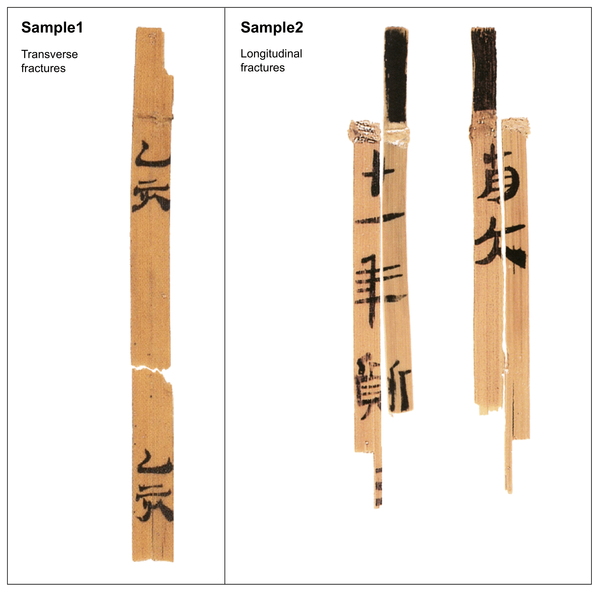
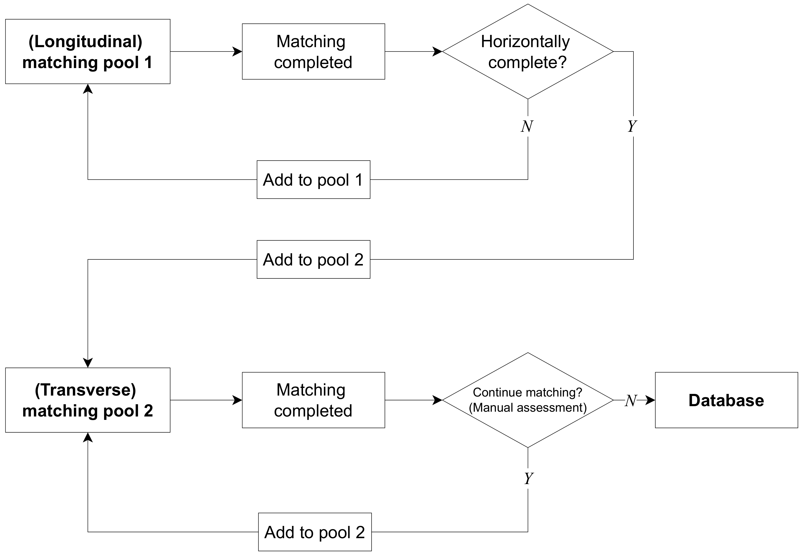
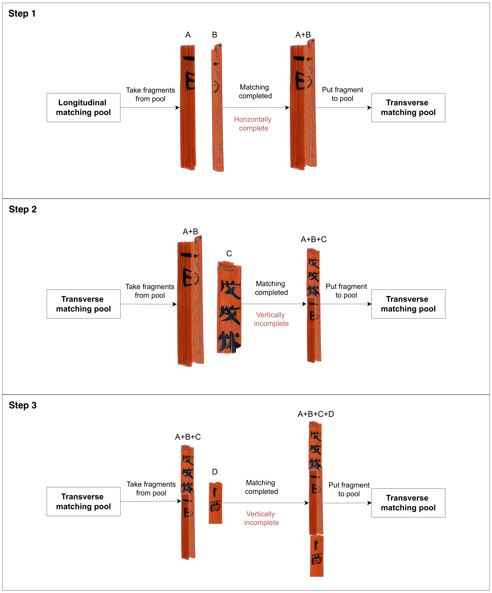
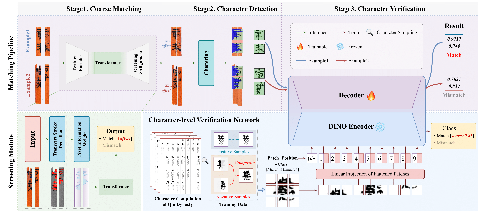

# Ongoing Work for Hybrid Fracture Handling

Bamboo slips exhibit transverse (Sample 1) and longitudinal fractures (Sample 2). Handling bamboo slip fragments with different fracture types presents a significant challenge in archaeological restoration. 

 
<em>Transverse and longitudinal fractures.</em>

## Hierarchical Two-Pool Workflow

It is difficult to design a unified algorithm that effectively handles both transverse and longitudinal fractures due to their fundamentally different characteristics. To address this, we have designed a hierarchical workflow that processes these two fracture types systematically.The workflow establishes two processing loops: a longitudinal matching pool and a transverse matching pool. Fragments are initially classified based on their horizontal completeness. The key insight is that longitudinally fractured fragments, once successfully matched and achieving horizontal completeness, are transferred from the longitudinal pool into the transverse pool for further vertical assembly. This sequential processing ensures systematic progression from partial fragments to complete slips.

 
<em>Two-pool workflow.</em>

## An example

The figure shows an example assembly using four fragments. Longitudinal fragments A and B first match to achieve horizontal completeness (Step 1), then the combined A+B unit progressively matches with transverse fragments C and D (Steps 2-3) to form a complete slip.

 
<em>Example assembly demonstrating hybrid fracture pattern handling across longitudinal and transverse matching stages.</em>

## Three-Stage Pipeline for Longitudinal Matching (Ongoing)

Our approach for longitudinal fractures employs a three-stage pipeline to address the 
challenge of matching straight-edged breaks that split through characters.

**Stage 1: Coarse Matching.** A Transformer-based screening module performs initial 
candidate filtering by extracting visual features from fragment pairs and computing 
alignment scores. This stage rapidly narrows down the search space from thousands of 
candidates to a manageable subset for detailed analysis.

**Stage 2: Character Detection.** A clustering algorithm segments the fragmented characters 
on both left and right fragments, identifying partial character regions that may form 
complete characters when properly aligned.

**Stage 3: Character Verification.** A DINO-ViT based verification network evaluates 
whether split character pairs from matched fragments form coherent complete characters. 
The network is trained using synthetic samples generated from historical Qin dynasty 
character compilations, addressing the data scarcity challenge. Character patches are 
encoded and compared through a decoder to determine match/mismatch classification.

This character-level verification approach enables matching decisions based on textual 
coherence rather than geometric features, complementing the physics-driven curve matching 
used for transverse fractures.

 
<em>Three-stage pipeline for character-based longitudinal fracture matching.</em>

